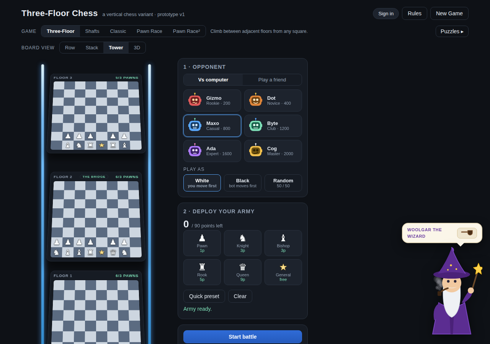
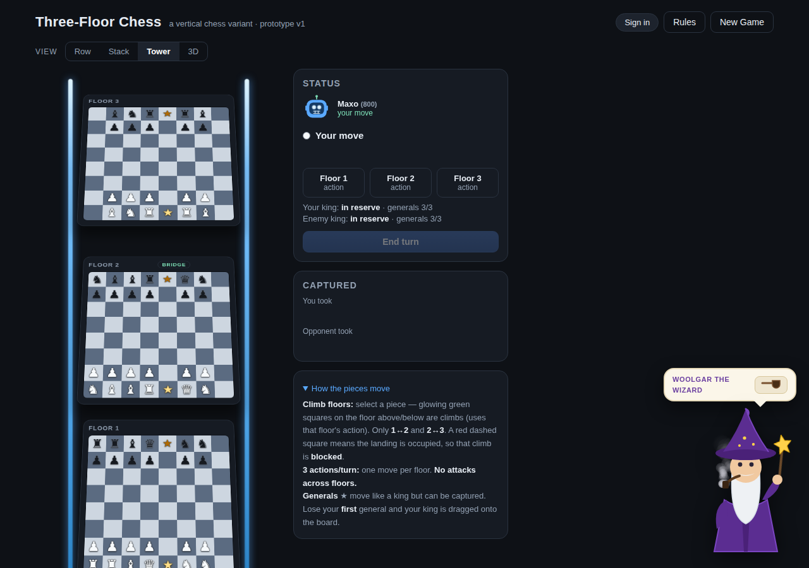
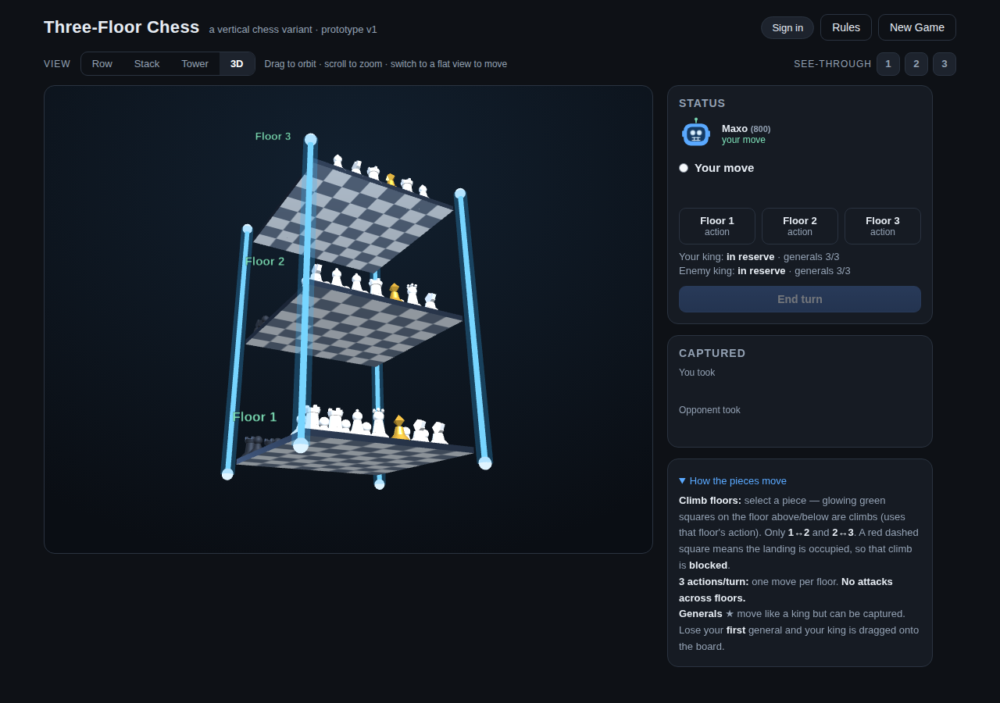
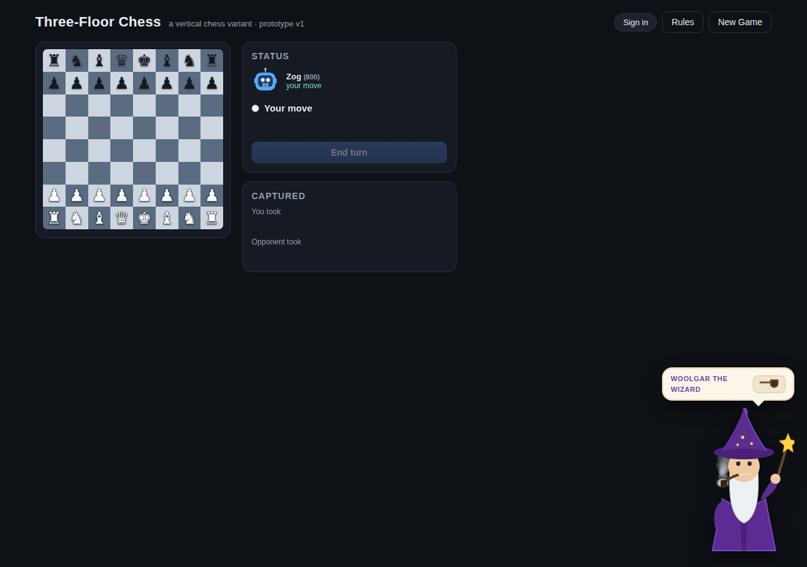
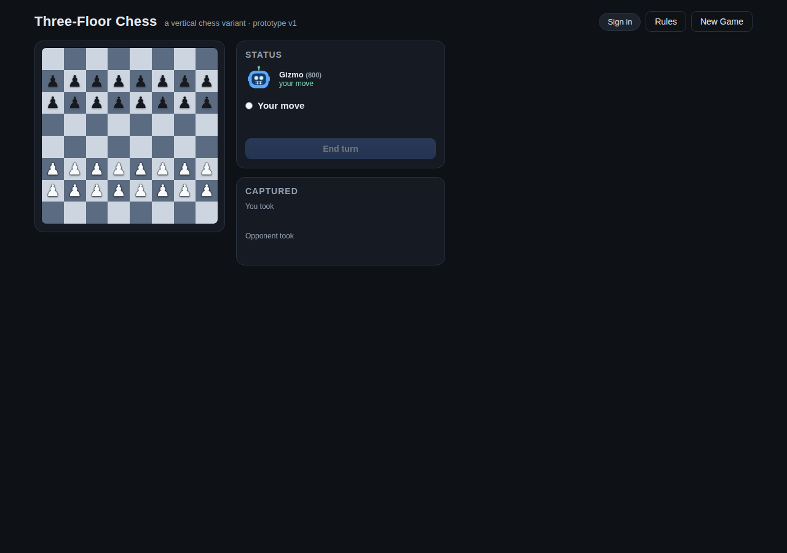
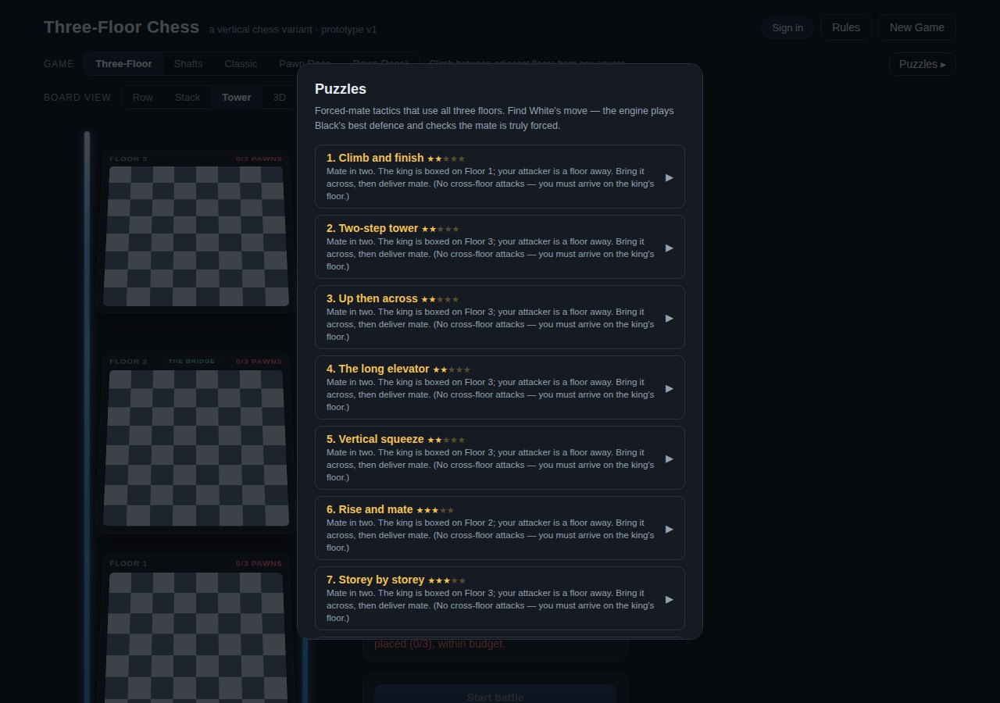
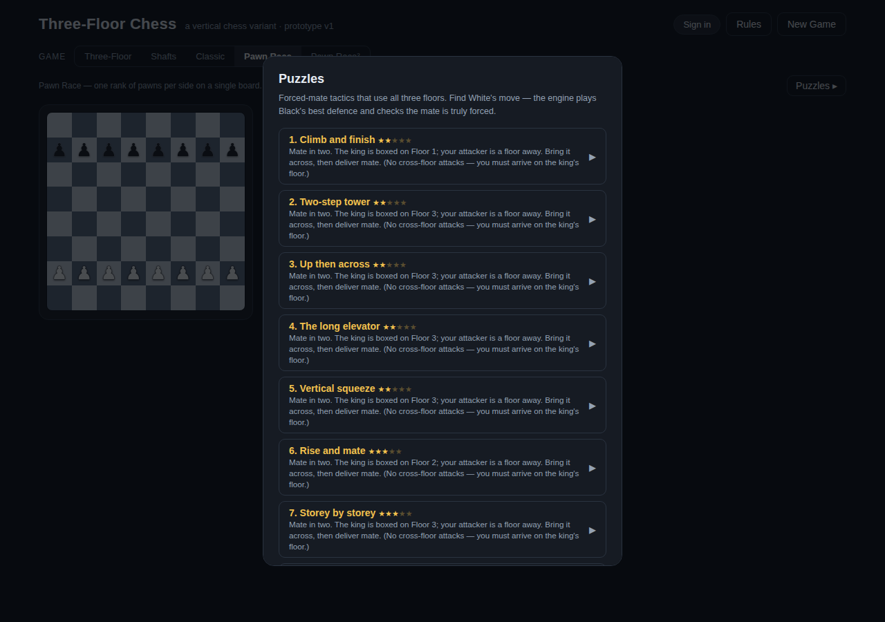
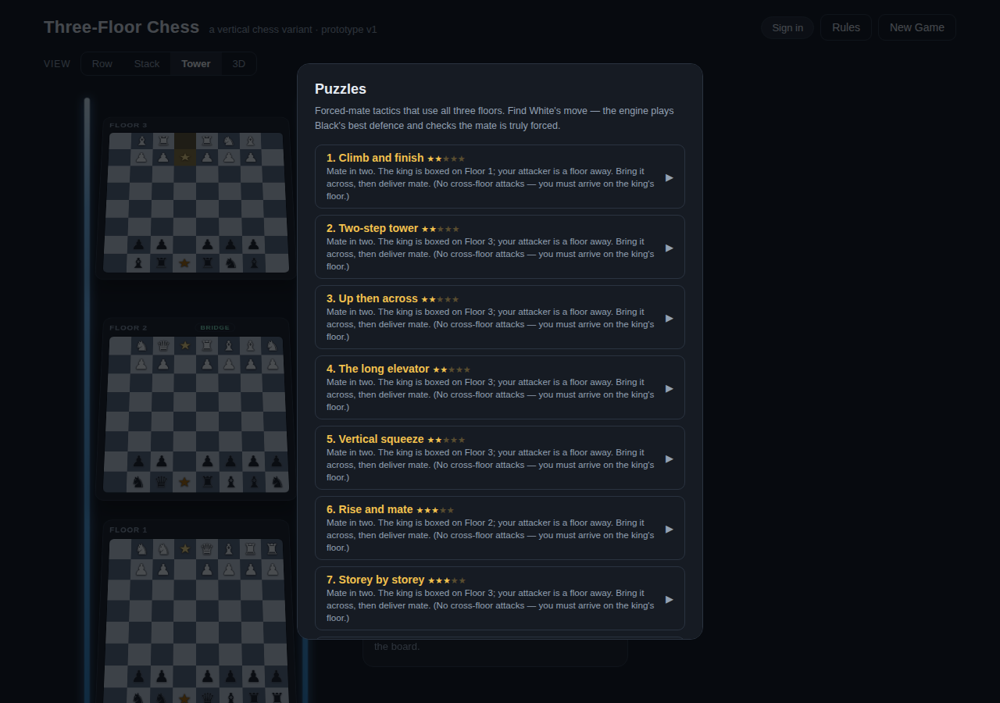

# Three-Floor Chess — Project Handoff

*A vertical chess variant played across three stacked 8×8 boards. This document is a
complete handoff so the project can be continued in Claude Code (or any editor). It
describes the vision, the full rules, the code architecture, what was built recently,
known findings, how to test, and the open backlog.*

**Current deliverable:** a single self-contained file, `three-floor-chess.html`
(~870 KB). Everything is inlined — game logic, a 3D renderer (Three.js), peer-to-peer
online play (PeerJS), a Supabase-or-local accounts backend, and an engine-verified
puzzle set. It runs offline by opening the file in a browser; no build step.

**Status:** playable prototype, ~v1.8 plus this session's changes (side picker, setup
board previews, Supabase backend, pawn-shield army fix).

---

## 1. How to use this doc in Claude Code

1. Put `three-floor-chess.html`, this `PROJECT.md`, the `images/` folder, and the
   design docs into a repo (suggested layout in §16).
2. The game is **one HTML file**. There is no bundler. Edit the `<script>` blocks in
   place. To find code, search for the **section banner comments** (all-caps headers
   inside big comment blocks) named throughout this doc — they are stable anchors even
   as line numbers shift.
3. Tests are **headless Playwright scripts** that drive the game through a debug API
   exposed on `window.__game` (see §14). Chromium is expected at
   `/opt/pw-browsers/chromium` in the sandbox; adjust `executablePath` for your machine.

---

## 2. Screens

| | |
|---|---|
| **Setup + deploy** (Three-Floor, Tower view). Note pawns shielding the back-rank officers. |  |
| **Play** — Three-Floor, Tower (isometric) view |  |
| **Play** — 3D orbitable view (Three.js), per-floor see-through |  |
| **Classic** — standard chess on one board |  |
| **Pawn Race²** — two ranks of pawns per side, first to promote wins |  |
| **Puzzles** — engine-verified vertical forced-mate tactics |  |
| **Setup board preview** — Classic/Pawn-Race now show the starting board + side picker |  |
| **Play as Black** — board flips, the bot opens as White |  |

---

## 3. The game — complete rules

**Board.** Three floors, each 8×8, stacked. Floor 1 = bottom, Floor 2 = middle
(the "bridge"), Floor 3 = top. Internally floors are indexed `0,1,2`.

**Turn structure.** On your turn you take **up to three actions — one per floor**, then
play passes. Each floor's action is either a normal chess move on that floor **or** a
vertical climb using that floor's action.

**Vertical movement (climb).** A piece climbs by moving straight up/down to the **same
square on an adjacent floor** (1↔2 or 2↔3 only, never 1↔3 — Floor 2 is the sole bridge).
If the destination square is occupied the climb is simply **blocked** (impossible, no
capture, no death). **The king cannot climb** — it is grounded. (This was the single
biggest balance fix; it made checkmate achievable.)

**Captures.** All captures happen **within a single floor**. There are **no cross-floor
attacks** — to attack a piece you must be on its floor.

**Pieces & values.** Pawn 1, Knight 3, Bishop 3, Rook 5, Queen 9. **Generals = 0.**
Pieces move as in standard chess on their floor. A pawn only gets its two-square first
move and en passant from its own starting rank (rank 2 for that side).

**Generals & the hidden king.** Each side has **3 generals** (free) that move like a king
but with no royal restrictions (may sit in check, may be captured). The **king starts off
the board** and is untouchable while all three generals stand. **When the first general is
captured, the defender must place their king** anywhere in their own half, any floor —
and it is attackable thereafter. Because the king is grounded, once placed it can be mated
on its floor.

**Deployment.** ~90-point budget per side. Every floor needs **3+ pawns**. Officers and
generals go on the back two ranks; extra pawns may forward-deploy to the halfway line
(rank 4). Promotion happens **on the pawn's own floor only**, to any of Q/R/B/N.

**Win conditions.** Checkmate the king (only possible once it has been forced out), or
eliminate the entire enemy army. Draws on stalemate or the no-progress rule (120 plies
without a capture or pawn move).

**Key tactical consequence of the 3-action turn.** Ordinary material tactics don't
transfer — a fork of king+queen wins nothing, because the defender can both move the king
out of check *and* move the queen to safety in one turn. **The sound forcing unit is
checkmate.** This is why the puzzle set is built entirely from forced mates.

---

## 4. Game modes

Selected by the `gameType` global: `'open' | 'shafts' | 'classic' | 'pawnrace1' | 'pawnrace2'`.

- **Three-Floor** (`open`) — the full variant. Any non-king piece may climb from any square.
- **Shafts** (`shafts`) — climbing only through fixed shafts. The 1↔2 shafts (queenside)
  and 2↔3 shafts (kingside) sit on different squares, so crossing the whole tower means
  traversing Floor 2. On-board markers: ▲ up, ▼ down. The king *may* climb here, but only
  via a shaft. Most decisive configuration.
- **Classic** (`classic`) — standard chess on one board, with castling, vs the bot. Backed
  by a full-strength alpha-beta engine.
- **Pawn Race / Pawn Race²** (`pawnrace1`/`pawnrace2`) — one or two ranks of pawns per side
  on a single board (Floor 2). First to run a pawn to the far side wins. Two-square opening
  and en passant apply.
- **Puzzles** — a difficulty-ranked (★1–5) set of ~29 forced-mate tactics that require the
  vertical dimension (the mating piece always starts on a different floor from the enemy
  king). The engine plays Black's best defence; every puzzle is re-verified against the real
  game engine as a forced mate in exactly N.

---

## 5. Data model

A game **state** `S` (created by `newState()`) holds:

- `pieces` — array of `{ id, type, color, floor, r, c, fwd, moved }`.
  `type ∈ {P,N,B,R,Q,K,G}`, `color ∈ {'w','b'}`, `floor ∈ {0,1,2}`, `r,c ∈ 0..7`,
  `fwd` = forward-deployed pawn, `moved` = has moved (for castling/first-move).
- `turn` (`'w'|'b'`), `floorsActed` (`[bool,bool,bool]`), `movedThisTurn` (id→bool),
  `actionsThisTurn`, `captured` (`{w:[types], b:[types]}`), `reserveKing`, `kingOut`,
  `generalsAlive` (`{w:3,b:3}`), `ep` (en-passant target), `mustPlace` (color that must
  place its king), `plyClock` (no-progress counter), `over` (`{winner, reason}` or null).

An **action** is `{ pid, f, from:{f,r,c}, to:{f,r,c}, cap:pid|0, kind:'move'|'climb',
promo, promoType, promoFloor, blunder }`.

---

## 6. Codebase architecture (single file, `three-floor-chess.html`)

The `<head>` holds CSS. The `<body>` holds the UI skeleton and then several `<script>`
blocks. Navigate by these **section banner comments**:

- **Rules engine** — `legalActions(st,color,ctx)`, `applyAction`, `inCheck`,
  `evaluateTurnStart`, `king`, `at`, movement generation incl. climbs and shaft rules.
- **`DRIVER: applying actions with full side-effects`** — `doAction` (capture piles,
  general-trigger → `mustPlace`, promotion, turn accounting), `endTurn` (no-progress clock,
  turn flip, terminal check), `aiPlayTurn`.
- **`UI`** — big block: setup rendering (`renderSetup`, `renderStartPreview`, `boardEl`,
  `paintPiece`, palette, `canPlace`, `validateSetup`), play rendering (`renderPlay`,
  `updateStatus`), input (`onPlayClick`, `applyLocal`, promotion), human king placement,
  the **AI turn loop** (`aiTurn`/`finishAiTurn`), `showOver`.
- **Preset armies** — `presetArmy` (fixed symmetric army, used by tests), `buildArmy`
  (random legal ~90-pt army with **pawn shields**, see §9), `presetFor` (bot army),
  `presetWhite` (human "Quick preset").
- **Pawn-race engine** — `prSearch`/`prBestAction`/`pawnRaceAI` (race-aware alpha-beta).
- **`classicSetup` / `pawnRaceSetup` / `startGame`** — mode setup + game start.
- **`PUZZLE MODE`** — `PUZZLES` array (hand-authored, engine-verified), `loadPuzzle`,
  `puzzleMultiMove` (you move; engine replies with best defence).
- **`3D TOWER VIEW (Three.js …)`** — WebGL scene, standing pieces, glowing rods,
  per-floor see-through, orbit controls.
- **`ONLINE MULTIPLAYER (PeerJS …)`** — host/join, room codes, invite links, deploy
  exchange, move sync, rated-game reporting.
- **`ACCOUNTS · FRIENDS · CHALLENGES · ELO`** (injected block near `</body>`) — the social
  layer: `SupabaseBackend`, `LocalBackend`, UI wiring, Elo, challenge→game bridge.

Key globals: `gameType`, `DIFF` (bot rating), `mode` (`'ai'|'online'`), `myColor`
(human's colour), `sideChoice` (`'w'|'b'|'rand'`), `layout` (board view), `S` (state),
`net`/`netMode` (online), `puzzleMode`. There is a debug/test bridge at `window.__game`
(see §14).

---

## 7. Engines & AI

Three separate engines, dispatched by `aiPlayTurn` on `gameType`:

- **Variant (Three-Floor / Shafts)** — a **turn-level negamax** (`vBestAction`/`vSearch`,
  config `VCFG`). It beam-expands each full 3-action turn, searches the opponent's full
  reply, and scores terminal states via the real checkmate test. Evaluation is
  material-centric.
- **Classic** — a real self-contained chess engine (`ceBestAction`, config `CE_RATING`):
  alpha-beta + iterative deepening + quiescence + transposition table + move ordering +
  check extensions + mate scores. Move generator is perft-verified.
- **Pawn race** — race-aware alpha-beta (`prSearch`) understanding passed pawns and
  promotion races.

**Rating ladder** (both `VCFG` and `CE_RATING`): tiers **200 / 400 / 800 / 1200 / 1600 /
2000**, presented as named bots (Rookie…Master). Lower tiers = shallower search + a
controlled slice of random/near-best choice (`rand`, `slack`); the top tier plays with no
artificial noise. There is a fast standalone copy of the variant engine at `tf.js` used for
puzzle generation (board = `Int8Array(192)`, index `f*64 + r*8 + c`).

> **Known limitation (important):** the variant AI is **passive** — it only takes *free*
> material and won't push pawns, break the position, or sacrifice to force a general off.
> See §15.

---

## 8. Board views & rendering

Four setup/play layouts via the `layout` global and `applyLayout()`:
`row`, `stack`, `iso` ("Tower", default), and `3d` (Three.js). `boardEl(floor)` builds an
8×8 grid and **orients to `myColor`** (Black sees the board flipped). Classic and Pawn Race
force a single-board `row` layout. `renderStartPreview()` draws a read-only starting board
on the setup screen for Classic/Pawn Race (added this session — see §11).

---

## 9. Army builder & the pawn-shield fix (this session)

`buildArmy(color, budget)` produces a random legal ~90-pt army: 3 free generals (col 4),
3+ pawns/floor, officers on the home rank respecting caps (Q1/R2/B2/N2 per floor).

**Fix:** every back-rank officer is now guaranteed a **pawn directly in front of it**
(a shield), reusing the mandatory floor pawns where possible and paying +1 pt for an open
file otherwise. This closes the **open-file rook raid**: previously a first-mover could
slide a rook the length of an open file and capture an undefended enemy rook on turn one
(observed: the bot took *three* rooks before the human's first move when playing Black).
Verified across 80 generated armies (all legal: 3 generals, 3+ pawns/floor, ≤90 pts, every
officer shielded) and in-game (0 captures through the opening, was 3 rooks).

---

## 10. Side selection — White / Black / Random (this session)

A **"Play as"** selector (`#sideSel`, values `w`/`b`/`rand`, handler `setSide`) in the
Opponent card, for all vs-computer modes. White always moves first; if the human is Black
the bot opens as White. Implementation notes for whoever continues:

- `startGame` resolves `myColor` from `sideChoice` (Random → coin flip). For the
  manual-deploy variants, if Random resolves to the opposite colour the human's deployed
  army is mirrored (`r → 7-r`) to the correct side.
- The AI loop is generalised: `aiTurn` uses `other(myColor)` (was hard-coded `'b'`), and
  the "your general fell, place your king" branch keys off `myColor` (was `'w'`).
- Board orientation already keyed off `myColor` in `boardEl`, so Black flips automatically.
- Online mode is unaffected (host = White, guest = Black); the selector hides in online mode.

---

## 11. Setup board previews (this session)

Selecting Classic or Pawn Race used to blank the left panel, leaving only the Tower
layout's two decorative glowing rods ("two rods"). `renderStartPreview()` now renders the
actual starting position there in `row` layout, flips with the side choice, and Three-Floor
restores its Tower layout on switch-back (`applyLayout()` in `setGameType`'s else branch).

---

## 12. Online multiplayer (PeerJS)

Peer-to-peer, **no game server** — uses the public PeerJS broker plus STUN/TURN (Google +
OpenRelay). Host creates a room code / invite link; guest joins. Deployments are exchanged,
then moves sync action-by-action; rated games report Elo through the social backend.

**Caveat for deployment:** invite links are built from `location.href`, so from a local
`file://` path they won't open for the other person. Hosting the file at a real URL (see
§16) makes invite links work.

---

## 13. Accounts / friends / challenges / Elo (Supabase, this session)

The social layer is behind one interface with two implementations:

- **`SupabaseBackend`** — Supabase Auth (email/password), Postgres tables
  (`profiles`, `friend_requests`, `friends`, `challenges`) with row-level security, and
  Realtime subscriptions for live requests/challenges. Loads `@supabase/supabase-js` from a
  CDN only when configured.
- **`LocalBackend`** — in-browser fallback (accounts/friends/Elo in memory; multiple tabs =
  multiple players). Active when Supabase isn't configured.

**Config** lives in the `window.SUPABASE_CONFIG = { url, anonKey }` block near the bottom
of the HTML (blank by default → local mode). Full setup (create project, disable email
confirmation, run the schema SQL) is in **`SUPABASE-SETUP.md`** — carry that file into the
repo. Elo: start 1000, K-factor 32; only online challenges between two accounts are rated
(bot and puzzle games are not).

> **Not yet done:** a real two-device live test of the online + Supabase path. Everything
> is verified against the interface and in local mode, but the live PeerJS + Supabase
> handshake between two browsers still needs one real run.

---

## 14. Testing — the `window.__game` bridge

The game exposes a debug API for headless tests: `window.__game` includes
`newState`, `presetArmy`, `presetFor`, `legalActions`, `ctxOf`, `doAction`, `endTurn`,
`aiPlayTurn`, `at`, `addPiece`, `king`, `inCheck`, `evaluateTurnStart`, `startGame`,
`setGameType`, `goPlay`, `setDiff`, getters/setters for `S`/`myColor`, and helpers.

Pattern (Playwright): load the file, then drive real UI clicks (e.g.
`document.querySelector('#gameToggle .segbtn[data-g="open"]').click()`) or call `__game`
directly, and read back `S`. Existing scripts of interest that should come across into the
repo: `test_social.js` (account/friend/challenge/Elo flow), `test_side.js` (side picker),
`test_shield.js` (army shielding + no turn-1 material loss), `study2.js` /
`diag_convert.js` (self-play balance harnesses), `tf.js` (fast standalone engine +
`testmulti.js`/`crossval.js` for puzzle verification). Note the sandbox is ephemeral — these
live only if committed.

---

## 15. Balance findings (see `design/balance-study.md` for detail)

- **Grounding the king** (it can't climb) took checkmate rates from ~0% to meaningful and
  is the core decisiveness fix.
- **The variant is a forced draw in engine self-play.** Across 40+ self-play games (tiers
  200–1200, two start methods) the result was **100% draws** — every game hit the 120-ply
  no-progress rule. A diagnostic showed the cause: from the symmetric deployment the bots
  make **zero captures** and **never force a king out of reserve**. The turn-level negamax
  only grabs free material; with no incentive to advance pawns or break the position, there
  is no contact, no general captured, no king forced out, so mate is structurally
  impossible.
- **First-move advantage** is therefore not measurable as a win rate — the only concrete
  first-mover edge that existed (the open-file rook raid) is now removed by the shield fix.
- **Top-priority next step:** add an **initiative/aggression term** to the variant
  evaluation (reward pawn advancement / space; value forcing a general off and massing
  attackers on the king's floor). That makes single-player decisive at higher tiers *and*
  lets the first-move-advantage study finally read a number. Re-run `study2.js`
  (mirror-pair method) afterwards.

---

## 16. Suggested repo layout & deployment

```
three-floor-chess/
├── three-floor-chess.html      # the game (single self-contained file)
├── PROJECT.md                  # this handoff
├── SUPABASE-SETUP.md           # backend setup + schema SQL
├── README.md                   # short: what it is, how to run/deploy
├── design/
│   ├── three-floor-chess-design.md
│   └── balance-study.md
├── engine/
│   └── tf.js                   # fast standalone variant engine (puzzle gen/verify)
├── tests/                      # Playwright harnesses (test_*.js, study2.js, …)
└── images/                     # screenshots (this folder)
```

**Deploy:** it's one static file, so any static host works (GitHub Pages, Netlify,
Cloudflare Pages, Vercel) → a real `https://` URL. That also (a) makes online invite links
work and (b) gives the Supabase login a stable home. Deploying live is the natural moment
to do the pending two-device online test.

**No build step** is required. If you later split the inlined libraries or add tooling,
keep a single-file build target — offline-in-one-file is a core property.

---

## 17. Backlog (prioritised)

1. **Variant AI initiative term** — unblocks decisiveness *and* the first-move study (§15).
2. **Two-device online + Supabase live test**; hosted URL so invite links work (§12, §16).
3. **In-game rematch and chat** for online play.
4. **Mate-in-3+ puzzles** (solver supports it; generation is slow — needs curated seeds or
   a faster engine) and more Shafts-specific puzzles.
5. **Rules experiments:** limit actions while in check (defender can't both escape and
   develop); insufficient-material draw; custom AI deployment.
6. **UX:** move pieces directly in the 3D view; coordinate labels.
7. **Longer term:** role of surviving generals after the king is out; dynamic floors;
   physical set + printed rulebook.

---

## 18. Changelog

- **2026-08-10** — Variant AI initiative overhaul (backlog #1): evalState gains
  progressive pawn-advancement (PADV table), a space term, officer proximity-to-
  generals/king hunting terms, all scaled by an urgency factor that grows with the
  no-progress clock (anti-draw). Fixed `clone()` dropping `plyClock` (made the new
  eval NaN inside search). Self-play at tier 800 went from 0 captures / 100%
  120-ply draws to full decisive games (e.g. checkmate turn 53; 30–40 captures).
  Testing gotcha documented: `__game.aiPlayTurn(color,diff)` is a wrapper over the
  UI's global `S` — set `__game.S` first or call the page-global `aiPlayTurn(st,…)`.
- **This session** — White/Black/Random side picker across all modes; setup board previews
  for Classic/Pawn Race; social backend switched to Supabase (with local fallback);
  pawn-shield fix in `buildArmy`; balance study concluding self-play is a forced draw due to
  AI passivity.
- **v1.8** — Puzzles rebuilt as ~29 multi-move vertical forced-mate tactics; documented the
  3-action-turn tactical consequence.
- **v1.7** — AI rebuilt into real engines (classic chess engine + variant turn-search;
  perft-verified).
- **v1.5** — King grounded; Shafts variant; Classic chess with castling.
- **v1.3** — Promotion on the pawn's own floor; blocked-climb feedback; 3D upgrade.
- **v1.2** — Online P2P (PeerJS).
